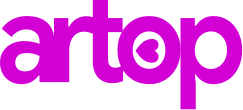

<div align="center">



### Aprende cualquier cosa. La IA construye el camino.

Plataforma de aprendizaje generativa con alma cyber-pop: lecciones cortas, racha, ligas y avatares. Divertida por fuera, seria por dentro.


</div>

---

## Que hay dentro

| Zona | Que es |
| ---- | ------ |
| **Mi Camino** | Ruta de aprendizaje en zigzag con unidades, nodos 3D y popup de lección anclado estilo Duolingo |
| **Lecciones** | Explicación + 5 ejercicios (opción múltiple, completar, V/F, ordenar) con feedback inmediato y resultado con XP |
| **Pase de batalla** | Temporadas y episodios, fila libre + premium, tiers que se desbloquean con energía |
| **Racha** | Calendario mensual, protectores y energía reclamable día a día |
| **Clasificación** | Ranked solo (Bronce → Campeón): compites contra ti, no contra nadie |
| **Avatares** | Totalmente customizables con DiceBear, se guardan en tu dispositivo |
| **Local-first** | Progreso, gemas, racha y configuración viven en `localStorage`. La IA genera, artop recuerda |

Además: modo claro/oscuro desde el día uno, diseño mobile-first que respira en PC, animaciones de 200–300ms que respetan `prefers-reduced-motion` y cero gradientes en la UI.

## Empieza en 10 segundos

Doble click a **`ABRIR.bat`** y listo: instala dependencias, abre el navegador y arranca el servidor.

O por terminal:

```bash
bun install
bun run dev
```

Abre [http://localhost:3000](http://localhost:3000) y cae directo en Mi Camino.

Otros comandos:

```bash
bun run build    # build de producción
bun run start    # servir el build
bun run typecheck
```

## Estructura

```text
app/
  camino/          Mi Camino (home)
  leccion/[id]/    Jugador de lecciones
  pase/            Pase de batalla
  racha/           Racha y energía
  clasificacion/   Ranked solo
  avatares/        Editor de avatar
  perfil/          Perfil, ajustes y galería del sistema
components/
  camino/  shell/  avatar/  ui/   # 20+ componentes reutilizables
lib/
  camino.ts  metas.ts  store.tsx  avatar.ts  anim.ts  theme.tsx
public/brand/      Logos oficiales en SVG
```

## Stack

Next.js 15 (App Router + Turbopack en dev) · React 19 · TypeScript estricto · Tailwind CSS v4 con design tokens propios · Phosphor Icons · DiceBear Adventurer · Bun como gestor de paquetes.

---

<div align="center">

Hecho con 💗 por **artop** — *dime qué quieres aprender, yo construyo el camino.*

<sub>alpha temprana: todo puede cambiar, nada está prometido.</sub>

</div>
